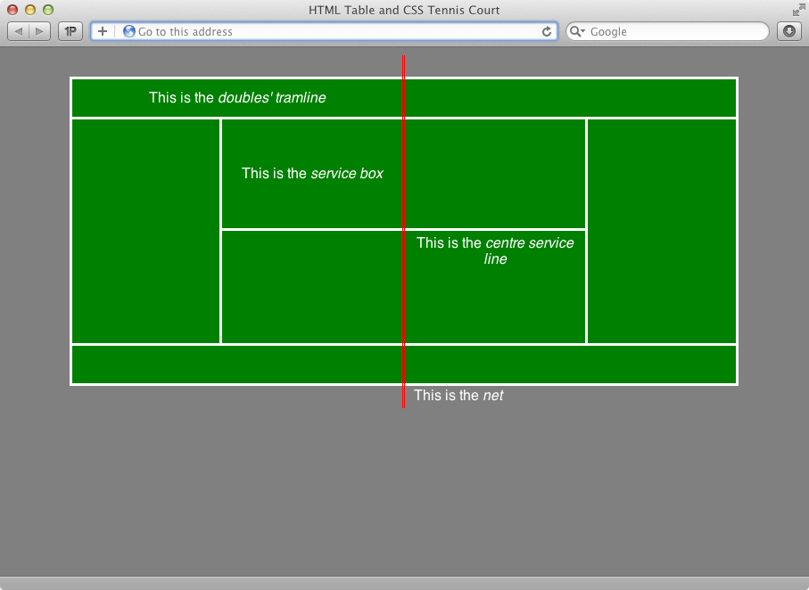

:page-layout: standard
:page-title: Year 9 IST - Activity Four
:icons: font

= Year 9 IST - Activity Four =

== Task: Table Tennis Court ==

Using only HTML tables and CSS styling (i.e. no cheating using images!) you need to re-create the representation of a tennis court, as shown in the screen shot below:

To take some of the guesswork out of the various sizes, colours, etc. used in the code which renders the above tennis court:

* The background colour of the page is `gray`
* The width of the entire tennis court is `750px`
* The width of the entire tennis court is `750px`
* The background colour of the tennis court is `green`
* The tennis court borders are `white` and `3px` in width
* The height of each _service box_ is `120px` and the width is `200px`
* The height of the _doubles' tramline_ is `40px`
* The colour of the net is `red` with a `double` border line style
* The distance between the edge of the court and end of the net (at the top and bottom) is `20px`

*PRO TIP:* You will need to use the `colspan` and `rowspan` properties of tables.

As always, your page needs to validate as XHTML 1.0 Strict at http://validator.w3.org. The page which contained the example above does validate, as shown below:

Good luck!
