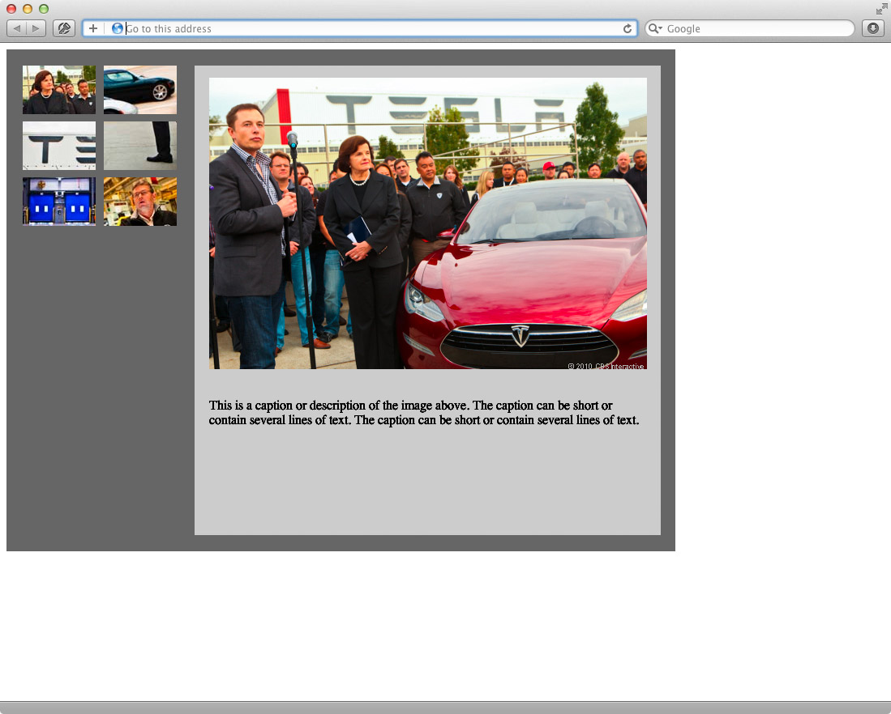

:page-layout: standard
:page-title: Year 9 IST - Activity Five
:icons: font

= Year 9 IST - Activity Five =

== Task: Image Gallery ==

=== Task Description ===

Using only XHTML and CSS (no tables allowed!) you need to replicate the following webpage:

The image gallery does not need to actually work (for the moment...) — it just needs to look like the above.

The graphics that you require for the above activity are listed here:

* link:image1.jpg[Image 1 - Big]
* link:image1_thumb.jpg[Image 1 - Thumbnail]
* link:image2_thumb.jpg[Image 2 - Thumbnail]
* link:image3_thumb.jpg[Image 3 - Thumbnail]
* link:image4_thumb.jpg[Image 4 - Thumbnail]
* link:image5_thumb.jpg[Image 5 - Thumbnail]
* link:image6_thumb.jpg[Image 6 - Thumbnail]

NOTE: You can directly reference the images from their existing locations, you do not need to upload them to your webspace.

For the grid of thumbnails you should use an unordered list.

You *CANNOT* use fixed positioning for this activity either.

The screen shot shown above is actual size, so to determine the correct size of the various screen areas you may wish to open that graphic in Photoshop (or alike) and do some measuring!

As always, your page needs to validate as XHTML 1.0 Strict at http://validator.w3.org[http://validator.w3.org^]. As an added bonus, your CSS also needs to validate at http://jigsaw.w3.org/css-validator/[http://jigsaw.w3.org/css-validator/^].

=== Challenge Activity ===

In this challenge activity you need to make the image gallery actually work. When the user hovers over a particular thumbnail it should display the larger version of the image in the designated space. It only has to display the image while the user has their mouse over (i.e. hovering over) a thumbnail - if the user moves their mouse away from a thumbnail, and it does not go onto another thumbnail, then it should just go back to displaying the first image.

This can be achieved without using Javascript (i.e. purely using CSS). However, I'll leave it up to you for the method that you would like to use. *If you can do this without using Javascript, and you instead purely use CSS, then you will receive a prize and Like stamp!*

Here are the full size images you need for the challenge activity:

* link:image1.jpg[Image 1 - Big]
* link:image2.jpg[Image 2 - Big]
* link:image3.jpg[Image 3 - Big]
* link:image4.jpg[Image 4 - Big]
* link:image5.jpg[Image 5 - Big]

Good luck!
