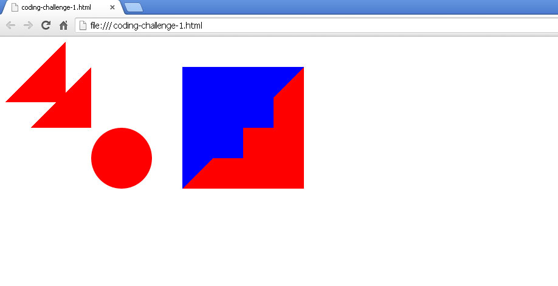
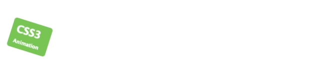
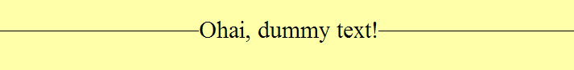

:page-layout: standard
:page-title: Year 9 IST - Challenge Activities
:icons: font

= Year 9 IST - Challenge Activities =

== Challenge One: Shapes ==

Your task is "simple" - re-create what you see in the screenshot above using only HTML and CSS. No images are allowed!. This only needs to work in Chrome.

Googling "drawing css shapes" is also a good starting point for more information.

Your HTML needs to validate, but your CSS does not.

== Challenge Two: Animation ==

Create the following animation using purely HTML and CSS.

For information, this has been done using CSS keyframes (which you may like to research).

The starting colour of the box is `#92B901` and the end colour of the box is `#1ec7e6`. The keyframe animation handles the transition between the colours.

Your HTML needs to validate, but your CSS does not.

== Challenge Three: Text ==

Create the following animation using purely HTML and CSS.

Can you do this - I'm talking about the text with the thin line behind the text? You need to follow the restrictions below:

* *Only one single h1 element is allowed in the body element of the page - no other tags are permitted*
* The `h1` text is horizontally centred in its parent `body` element
* The line is vertically centred on the text
* Both the font size and the text have to be editable without having to edit the line
* No images and no JavaScript are allowed
* Your HTML needs to validate, but your CSS does not.

*Note: While this activity looks easy, when you consider the restrictions above it is actually quite tricky. Good luck!*
