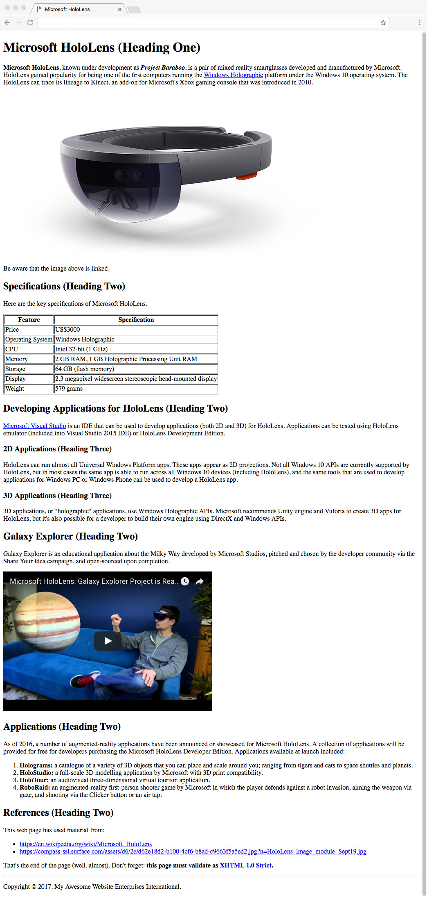

:page-layout: standard_toc
:page-title: Year 9 IST - Assignment One
:icons: font

= Year 9 IST - Assignment One =

*Weight:* 25% +
*Due:* Tuesday 21 March 2017 (Week 8) by 8:45am

== Changelog ==

This assignment was last updated on *Saturday 11 February 2017*.

If any changes are made to the assignment they will be itemised here for ease of identification.

== Task Context ==

This assignment requires you to code a single webpage which complies (and validates) with the XHTML 1.0 Strict standard.

=== CSS coding ===

This task does not require any CSS coding - it is purely an HTML coding exercise.

=== Marking guidelines ===

Make sure that you consult the <<_marking_guidelines, marking guidelines>> at the end of this document to ensure that your submission meets all the requirements. This specifically specifies what you need to do in order to gain every mark for this task.

=== How to start ===

Make sure you fully read this document first, and then go the <<_getting_started, Getting Started>> section.

=== Outcomes/Assessment Criteria ===

* 5.1.1 select and justify the application of appropriate software programs to a range of tasks
* 5.2.1 describe and apply problem-solving processes when creating solutions
* 5.2.2 design, produce and evaluate appropriate solutions to a range of challenging problems
* 5.3.2 acquire and manipulate data and information in an ethical manner
* 5.5.2 communicate ideas, processes and solutions to a targeted audience

== Task Requirements ==

Read this section carefully, it describes what you need to do for this task.

=== Sample Page Screenshot ===

You need to create a web page which *EXACTLY* replicates the content and layout of the page shown below (this is a screenshot, so you cannot copy and paste anything from this example).

Be aware, the text wrapping of the page will change depending on the width of the browser window (e.g. if you have a wider browser window then the text will wrap onto the next line at a different point). This is fine and is unavoidable.

The page below has been displayed/rendered in https://www.google.com/chrome[Google Chrome^] version 56 (the latest version available at the time of writing). Your assignment will be only tested in Chrome, so you should do all your development and testing in Chrome. If you are developing on a Windows-based PC then the font rendering may be slightly different (i.e. less smooth) — that is fine.

Additionally, your webpage must *FULLY* validate (i.e. with no warnings or errors) as XHTML 1.0 Strict using the W3C validator located at http://validator.w3.org[http://validator.w3.org^].

_Tip, click the image to see a larger version._

=== Page Text ===

To avoid you having to retype all the text in the page you can find a copy of the web page text below, so that it can be copied and pasted into your own page.

Note: There are some references in the page (e.g. [1], [2], etc.) which tell you the destination of links, source of images, etc. *Make sure you DO NOT include those in your web page*, as they are just to provide you with information that is not obvious from the screen shot above.

....
Microsoft HoloLens (Heading One)

Microsoft HoloLens, known under development as Project Baraboo, is a pair of mixed reality smartglasses developed and manufactured by Microsoft. HoloLens gained popularity for being one of the first computers running the Windows Holographic[1] platform under the Windows 10 operating system. The HoloLens can trace its lineage to Kinect, an add-on for Microsoft's Xbox gaming console that was introduced in 2010.

HOLOLENS PRODUCT IMAGE[2][3]

Be aware that the image above is linked.

Specifications (Heading Two)

Here are the key specifications of Microsoft HoloLens.

Feature				Specification
Price				US$3000
Operating system 		Windows Holographic
CPU				Intel 32-bit (1 GHz)
Memory				2 GB RAM, 1 GB Holographic Processing Unit RAM
Storage				64 GB (flash memory)
Display				2.3 megapixel widescreen stereoscopic head-mounted display
Weight				579 grams

Developing Applications for HoloLens (Heading Two)

Microsoft Visual Studio[4] is an IDE that can be used to develop applications (both 2D and 3D) for HoloLens. Applications can be tested using HoloLens emulator (included into Visual Studio 2015 IDE) or HoloLens Development Edition.

2D Applications (Heading Three)

HoloLens can run almost all Universal Windows Platform apps. These apps appear as 2D projections. Not all Windows 10 APIs are currently supported by HoloLens, but in most cases the same app is able to run across all Windows 10 devices (including HoloLens), and the same tools that are used to develop applications for Windows PC or Windows Phone can be used to develop a HoloLens app.

3D Applications (Heading Three)

3D applications, or "holographic" applications, use Windows Holographic APIs. Microsoft recommends Unity engine and Vuforia to create 3D apps for HoloLens, but it's also possible for a developer to build their own engine using DirectX and Windows APIs.

Galaxy Explorer (Heading Two)

Galaxy Explorer is an educational application about the Milky Way developed by Microsoft Studios, pitched and chosen by the developer community via the Share Your Idea campaign, and open-sourced upon completion.

GALAXY EXPLORER VIDEO[5]

Applications (Heading Two)

As of 2016, a number of augmented-reality applications have been announced or showcased for Microsoft HoloLens. A collection of applications will be provided for free for developers purchasing the Microsoft HoloLens Developer Edition. Applications available at launch included:

Holograms: a catalogue of a variety of 3D objects that you can place and scale around you; ranging from tigers and cats to space shuttles and planets.
HoloStudio: a full-scale 3D modelling application by Microsoft with 3D print compatibility.
HoloTour: an audiovisual three-dimensional virtual tourism application.
RoboRaid: an augmented-reality first-person shooter game by Microsoft in which the player defends against a robot invasion, aiming the weapon via gaze, and shooting via the Clicker button or an air tap.

References (Heading Two)

This web page has used material from:

https://en.wikipedia.org/wiki/Microsoft_HoloLens[6]
https://compass-ssl.surface.com/assets/d6/2e/d62e18d2-b100-4cf6-b8ad-c9663f5a5ed2.jpg?n=HoloLens_image_module_Sept19.jpg[7]

That's the end of the page (well, almost). Don't forget: this page must validate as XHTML 1.0 Strict[8].

Copyright [copyright symbol] 2017. My Awesome Website Enterprises International.

[1] Text link: https://en.wikipedia.org/wiki/Windows_Holographic
[2] Image source: https://raw.githubusercontent.com/CanberraGrammar/year9-website/master/2017/s1assign1/hololens.jpg
[3] Image link: https://www.microsoft.com/microsoft-hololens
[4] Text link: https://en.wikipedia.org/wiki/Microsoft_Visual_Studio
[5] Video source: https://www.youtube.com/watch?v=HsnH2Q7HxOA
[6] Text link: https://en.wikipedia.org/wiki/Microsoft_HoloLens
[7] Text link: https://compass-ssl.surface.com/assets/d6/2e/d62e18d2-b100-4cf6-b8ad-c9663f5a5ed2.jpg?n=HoloLens_image_module_Sept19.jpg
[8] Text link: http://validator.w3.org
....

[#_getting_started]
=== Getting Started ===

Fork the *Assignment 1 (Semester 1)* workspace in ED STEM which will provide you with a valid XHTML 1.0 Strict template to commence work. *DO NOT* rename this workspace, otherwise we might not be able to find your work later for marking.

== Hints and Pro Tips ==

Here you can find various hints and tips to complete the assignment tasks.

* You must have attention to detail and ensure that your page EXACTLY replicates the sample page, including individual spaces between words in the text portions of the page and also comments which have been included to help you (e.g. _Be aware that the image above is linked_). Any differences will result in lost marks. *You are strongly encouraged to have someone else (e.g. parents) look over your page for any differences.*
* Your webpage must FULLY validate (i.e. with no warnings or errors) as XHTML 1.0 Strict using the W3C validator located at http://validator.w3.org[http://validator.w3.org^].
* Make sure that you look at the sample page carefully and note any text in *bold*, _italics_, or other special formatting as that all needs to be replicated in your version of the page.
* The HoloLens image is available from https://raw.githubusercontent.com/CanberraGrammar/year9-website/master/2017/s1assign1/hololens.jpg[https://raw.githubusercontent.com/CanberraGrammar/year9-website/master/2017/s1assign1/hololens.jpg^]. Do not locally download the hololens.jpg file to your ED STEM workspace - source the image from github.com using this address.
* The HoloLens image is linked to: https://www.microsoft.com/microsoft-hololens[https://www.microsoft.com/microsoft-hololens^].
* *There are some links in the page and the destination of these links is not obvious from the screenshot. As such, the link destinations are included in the web page text extract included above. Don't forget to include them!
* The dimensions / size of the embedded YouTube video is `width="510"` and `height="340"`.

== Submission Instructions ==

This assignment is worth 25% of your Semester One assessment for this subject.

You must place the following declaration (in the form of a comment) at the top of your submitted HTML file:

....
<!--
// This project is submitted as part of the assessment for Year 9 IST.
// This is all my own work. I have referenced any work used from other
// sources and have not plagiarised the work of others.
// (signed) Your Name
-->
....

Make sure you understand the implications of this declaration which you are including and digitally signing (see the <<_academic_honesty, Academic Honesty>> section of this document for more information).

*If you do not include the student declaration at the top of your HTML file your assignment will not be marked and you will receive zero.*

To submit your assignment you do not need to do anything, we will view your submission in your ED STEM workspace. However, you *must not* change your workspace after the due date and time. We can see the revision history on your workspace and will be actively checking the last time you modified the workspace.

*Late submissions will incur penalties as per the school assessment policy:* Students will lose 10% of the total value of the assessment per day late, or part thereof. *Be aware, if you do not submit your assignment by 8:45am on Tuesday 21 March 2017 that is counted as a day late and will attract the 10% penalty.* Weekends equate to 2 days. On the second day of non submission parents will be informed. A student may be directed to study support to complete an overdue assessment task. After 4 days, a student who has not submitted an assessment task will receive an academic detention. Work completed during academic detention or submitted more than 4 days late will have 50% of the total value of the assessment deducted from the student's score. If the work remains incomplete despite the academic detention, the student will receive zero marks for the task.

=== Draft submissions ===

You may optionally (but strongly encouraged) submit one draft of your assignment for review prior to formal submission. Your draft must be feature complete (i.e. not a half-done assignment) and submitted at least one week before the assignment due date - for this assignment, drafts are due by 8:45am on Tuesday 14 March 2017). To submit a draft email your teacher and let them know your workspace is ready to be reviewed.

[#_marking_guidelines]
=== Marking Guidelines ===

link:marking-guidelines.pdf[Your assignment will be marked following the criteria in this PDF file.^]

*You must NOT use any CSS code in this assignment.* This includes usage of in-line styles (e.g. `
`). There should be no need to use CSS anyway, as there is no special styling required in this task.

[#_academic_honesty]
== Academic Honesty

include::../common/academic_honesty.adoc[]
