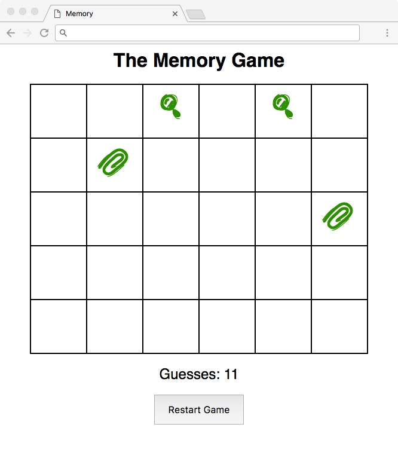

:page-layout: standard_toc
:page-title: Year 9 IST - Assignment One
:icons: font

= Year 9 IST - Assignment One =

*Weight:* 40% +
*Due:* Tuesday 5 September 2017 (Week 8) by 8:45am

== Changelog ==

This assignment was last updated on *Monday 31 July 2017*.

If any changes are made to the assignment they will be itemised here for ease of identification.

== Task Requirements ==

For this task you will be creating an online implementation of the game Memory (similar to http://en.wikipedia.org/wiki/Concentration_(game)[Concentration^] which is a version played with cards). A grid will be presented and the player clicks a square to reveal a symbol. They then need to click another square to reveal the matching symbol. If they match, both squares remain revealed and become green - indicating they have been solved. If they don't match, both squares go blank and the user tries again. The object of the game is to match all the symbols in the least number of attempts.

=== Symbols ===

The symbols in this game are actually a font called *PWSmallIcons*, with each symbol being a character from A - Z (uppercase) or a - z (lowercase). You will need to use `@font-face` to import the font into your CSS. The font is included in the ED Workspace for this assignment, and we have already even linked it up for you (because we're nice!).

When you are randomly selecting symbols, only use symbols represented by the letters A - Z (uppercase) or a - z (lowercase).

Also, at the bottom of the template for the assignment you will also notice the following code:

....

    

....

This will simply request that the browser display an empty span using the custom font PWSmallIcons. The browser will only load a web font when it needs to be used, so this will force the loading before the game starts - caching the font, so it should appear immediately in the game. If you don't pre-load the font then the first time is needs to appear there will be a slight delay as it downloads the font from the server. This gets around that issue.

The `opacity` of the div is `0` so it will be invisible, but it still does occupy blank space on the page (thus the reason for putting it at the bottom of your HTML, so it doesn't push any other content around).

=== Template ===

The template called *The Memory Game (Template)* is available in ED for this task. Please fork and use this template for your submission.

This template also includes the CSS which you will need, along with the HTML. However, you are welcome to edit the CSS and HTML if needed - so long as the game looks identical to the sample program (below).

=== Sample Program ===

A sample program is provided and your app must replicate this sample program.

link:sample_game.html[CLICK HERE FOR THE SAMPLE GAME^]

I am well aware that by providing a sample program in JavaScript I have exposed the source code of my program. If you take a look at the source code you will notice that it has been minified and obfuscated – this means that the code has been made very unreadable (by removing all whitespace, indentation, and renaming various variables and functions to unhelpful names). It has also been highly optimised. While this is not fool-proof, it will make it very difficult for you to reverse engineer your solution from my sample program. I am also aware that you could put this minified code through something like jsbeautifier.org to make it more readable, but it is still far from easily understandable code. My suggestion is that you do not try to figure out how my code works but instead focus on writing your own program, as that will be a much easier route to take!

No programmer is perfect, so if you think that you've found an error or bug in the sample app then please let me know: matthew.purcell@cgs.act.edu.au.

=== Hints and Pro Tips ===

Here you can find various hints and tips to complete the assignment tasks.

* You must have attention to detail and ensure that your game correctly replicates the sample game. Note that because you are being given a sample program far less specific information about the behaviour of the game is provided on this page — it's up to you to throughly test the sample app to see how it behaves/works under different conditions/inputs.

* Your webpage must validate (i.e. with no warnings or errors) as HTML5 using the W3C validator located at http://validator.w3.org.

* You may also find the code snippet below useful:

==== Fisher-Yates Shuffle ====

The Fisher-Yates Shuffle is defined as "an algorithm for generating a random permutation of a finite set – in plain terms, for randomly shuffling the set" http://en.wikipedia.org/wiki/Fisher%E2%80%93Yates_shuffle[[1^]]. In even plainer terms than that, it allows you to randomly shuffle an array. You may find this useful, so I have included a version below which randomly shuffles a JavaScript array:

....
// Credit: http://stackoverflow.com/questions/2450954/how-to-randomize-shuffle-a-javascript-array

function shuffleArray(array) {

    var currentIndex = array.length, temporaryValue, randomIndex;

    // While there remain elements to shuffle...
    while (0 !== currentIndex) {

        // Pick a remaining element...
        randomIndex = Math.floor(Math.random() * currentIndex);
        currentIndex -= 1;

        // And swap it with the current element.
        temporaryValue = array[currentIndex];
        array[currentIndex] = array[randomIndex];
        array[randomIndex] = temporaryValue;

    }

    return array;
}
....

== Submission Instructions ==

This assignment is worth 25% of your Semester One assessment for this subject.

You must place the following declaration (in the form of a comment) at the top of the `index.html` page:

....
<!--
// This project is submitted as part of the assessment for Year 9 IST.
// This is all our own work. We have referenced any work used from other
// sources and have not plagiarised the work of others.
// (signed) Your Name
-->
....

Make sure you understand the implications of this declaration which you are including and digitally signing (see the <<_academic_honesty, Academic Honesty>> section of this document for more information).

*If you do not include the student declaration at the top of your HTML file your assignment will not be marked and you will receive zero.*

To submit your assignment you do not need to do anything, we will view your submission in your ED workspace. However, you *must not* change your workspace after the due date and time. We can see the revision history on your workspace and will be actively checking the last time you modified the workspace.

*Late submissions will incur penalties as per the school assessment policy:* Students will lose 10% of the total value of the assessment per day late, or part thereof. *Be aware, if you do not submit your assignment by 8:45am on Tuesday 5 September 2017 that is counted as a day late and will attract the 10% penalty.* Weekends equate to 2 days. On the second day of non submission parents will be informed. A student may be directed to study support to complete an overdue assessment task. After 4 days, a student who has not submitted an assessment task will receive an academic detention. Work completed during academic detention or submitted more than 4 days late will have 50% of the total value of the assessment deducted from the student's score. If the work remains incomplete despite the academic detention, the student will receive zero marks for the task.

=== Draft Submissions ===

You may optionally submit *one* draft of your assignment for review prior to formal submission. Your draft must be feature complete (i.e. not a half-done assignment) and submitted at least one week before the assignment due date - for this assignment, drafts are due by 8:45am on Tuesday 29 August 2017).

Send an email to your teacher when your draft is ready for review.

[#_marking_guidelines]
== Marking Guidelines ==
We have changed the way that programming-style tasks will be marked. This is in recognition that some students are stronger programmers than others, and we want to reward not only the final product you produce, but also the effort that you invest in your submission.

This assignment will be marked according to four axis:

* *Scope:* To what extend does your submission implement (or attempt to implement) the features required by the specification?
** We are interested in whether you made an *effort* to get your code to match the requirements.
** This doesn't necessary mean that your solution has to work, but you need to show that you have thought through the steps to _try_ to make it work.
** There's no reason that you should not always receive a 5 for scope, as you should always be putting in effort.
* *Correctness:* To what extend is your code consistent with the specifications and free of bugs?
* *Design:* To what extent is your code written well (i.e. clearly, efficiently, elegantly, and/or logically)?
* *Style:* To what extend is your code readable (i.e. commented and intended with variables appropriately named)?

Each axis will be marked on a five point scale:

* 5 = Excellent, essentially no room for improvement
* 4 = Very good, minor room for improvement
* 3 = Good, some room for improvement
* 2 = Fair, ample room for improvement
* 1 = Poor
* 0 = No attempt

Your final mark for this assignment will be calculated using the following formula:
`Final Mark = Scope × (3 × Correctness + 2 × Design + 1 × Style)`

As you can see, we place the most importance and weighting on scope - the effort which you invest in your submission to try and meet the requirements.

[footnote]##Based upon Harvard University https://cs50.harvard.edu/[CS50's^] grading, used and adapted with permission. Thanks to Prof. David J. Malan.##

[#_academic_honesty]
== Academic Honesty

include::../common/academic_honesty.adoc[]
