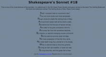
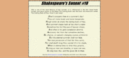

:page-layout: standard
:page-title: Year 9 IST - Activity Two
:icons: font

= Year 9 IST - Activity Two =

== Task: Shakespeare's (Improved) Sonnet ==

This second activity will help you to recap your CSS text formatting skills, as well as start using margins and padding.

You should create a new workspace called *Activity 2* and make an HTML file called `index.html` inside the workspace. You will also need to create a CSS file called `main.css` in which you need to write all your CSS code for this activity.

At the end of the activity your page needs to look like the following (click for a larger version):

Here's the HTML to get you started:

....
<html>
	<head>
		<title>CSS Challenge 2</title>
	</head>
	<body>
		<h1>Shakespeare's Sonnet #18</h1>
		
This is one of the most famous of the sonnets. It is referenced
		in the film Dead Poets Society and gave names to the band The
		Darling Buds and the book and television series The Darling Buds
		of May. Read it and weep!

		<ul>
			<li>Shall I compare thee to a summer's day?</li>
			<li>Thou art more lovely and more temperate:</li>
			<li>Rough winds do shake the darling buds of May,</li>
			<li>And summer's lease hath all too short a date:</li>
			<li>Sometime too hot the eye of heaven shines,</li>
			<li>And often is his gold complexion dimm'd,</li>
			<li>And every fair from fair sometime declines,</li>
			<li>By chance, or nature's changing course untrimm'd:</li>
			<li>But thy eternal summer shall not fade,</li>
			<li>Nor lose possession of that fair thou ow'st,</li>
			<li>Nor shall death brag thou wander'st in his shade,</li>
			<li>When in eternal lines to time thou grow'st,</li>
			<li>So long as men can breathe, or eyes can see,</li>
			<li>So long lives this, and this gives life to thee.</li>
		</ul>
		
See the
		<a href="http://en.wikipedia.org/wiki/Shakespeare%27s_Sonnets">
		Shakespeare's sonnets</a> Wikipedia article for more information

	</body>
</html>
....

Hints:

* The heading font is Verdana and the body font is Arial.
* Make sure that your page validates as XHTML 1.0 Strict at http://validator.w3.org[http://validator.w3.org^].
* Make sure that your CSS validates at http://jigsaw.w3.org/css-validator[http://jigsaw.w3.org/css-validator^].

=== Challenge Activity ===

image::../../common/like_stamp.jpg[Like Stamp]

Done the first activity? We've got another! You should create a new workspace called *Activity 2a* and make a new HTML file called `index.html` inside this folder. You will also need to create a CSS file called `main.css` in which you need to write all your CSS code for this activity.

Make your page look like the following (click for a larger version) which uses a few more advanced (though not too hard) CSS techniques:

This activity uses the same HTML source code as the first part.

Just use sans-serif as the font for this activity, do not worry if the font looks different. I am more interested in you getting the other aspects of the page correct (i.e. overall layout, borders, etc.).

*NOTE:* This challenge requires you to create a fixed-width layout that is centred in the browser window. Click on an image for a closer view.

'''

[footnote]##Credit: Wikiversity, Web Design/CSS Challenges 1: http://en.wikiversity.org/wiki/Web_Design/CSS_challenges[http://en.wikiversity.org/wiki/Web_Design/CSS_challenges^]##
