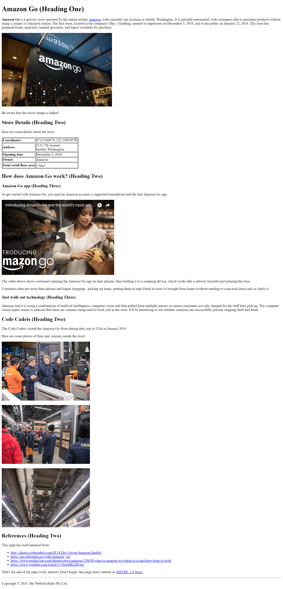

:page-layout: standard_toc
:page-title: Year 8 IST - Assignment One
:icons: font

= Year 8 IST - Assignment One =

*Weight:* 25% +
*Due:* Tuesday 3 April 2018 (Week 9) by 8:45am

== Changelog ==

This assignment was last updated on *Tuesday 20 February 2018*.

If any changes are made to the assignment they will be itemised here for ease of identification.

*Friday 16 February 2018:* The assignment was published

*Tuesday 20 February 2018:* The assignment was updated:

* The Page Text section was changed from "Here are some photos of their journey!" to "Here are some photos of their epic journey inside the store!" to match the sample webpage image
* The hints were revised to advise that the title of the webpage is "Amazon Go"

== Task Context ==

This assignment requires you to code a single webpage which complies (and validates) with the XHTML 1.0 Strict standard.

=== CSS coding ===

This task does not require any CSS coding - it is purely an HTML coding exercise.

=== Marking guidelines ===

Make sure that you consult the <<_marking_guidelines, marking guidelines>> at the end of this document to ensure that your submission meets all the requirements. This specifically specifies what you need to do in order to gain every mark for this task.

=== How to start ===

Make sure you fully read this document first, and then go the <<_getting_started, Getting Started>> section.

=== Outcomes/Assessment Criteria ===

* 5.1.1 select and justify the application of appropriate software programs to a range of tasks
* 5.2.1 describe and apply problem-solving processes when creating solutions
* 5.2.2 design, produce and evaluate appropriate solutions to a range of challenging problems
* 5.3.2 acquire and manipulate data and information in an ethical manner
* 5.5.2 communicate ideas, processes and solutions to a targeted audience

== Task Requirements ==

Read this section carefully, it describes what you need to do for this task.

=== Sample Page Screenshot ===

You need to create a web page which *EXACTLY* replicates the content and layout of the page shown below (this is a screenshot, so you cannot copy and paste anything from this example).

Be aware, the text wrapping of the page will change depending on the width of the browser window (e.g. if you have a wider browser window then the text will wrap onto the next line at a different point). This is fine and is unavoidable.

The page below has been displayed/rendered in https://www.google.com/chrome[Google Chrome^] version 64 (the latest version available at the time of writing). Your assignment will be only tested in Chrome, so you should do all your development and testing in Chrome. If you are developing on a Windows-based PC then the font rendering may be slightly different (i.e. less smooth) — that is fine.

Additionally, your webpage must *FULLY* validate (i.e. with no warnings or errors) as XHTML 1.0 Strict using the W3C validator located at http://validator.w3.org[http://validator.w3.org^].

_Tip, click the image to see a larger version._

=== Page Text ===

To avoid you having to retype all the text in the page you can find a copy of the web page text below, so that it can be copied and pasted into your own page.

Note: There are some references in the page (e.g. [1], [2], etc.) which tell you the destination of links, source of images, etc. *Make sure you DO NOT include those in your web page*, as they are just to provide you with information that is not obvious from the screen shot above.

....
Amazon Go (Heading One)

Amazon Go is a grocery store operated by the online retailer Amazon[1], with currently one location in Seattle, Washington. It is partially-automated, with customers able to purchase products without using a cashier or checkout station. The first store, located in the company's Day 1 building, opened to employees on December 5, 2016, and to the public on January 22, 2018. The store has prepared foods, meal kits, limited groceries, and liquor available for purchase.

AMAZON GO STORE IMAGE [2][3]

Be aware that the above image is linked.

Store Details (Heading Two)
Here are some details about the store.

Coordinates	47.615868°N 122.339850°W
Address	2131 7th Avenue
Seattle, Washington
Opening date	December 5, 2016
Owner	Amazon
Total retail floor area	170m2

How does Amazon Go work? (Heading Two)

Amazon Go app (Heading Three)

To get started with Amazon Go, you need an Amazon account, a supported smartphone and the free Amazon Go app.

AMAZON GO VIDEO[4]

The video above shows customers opening the Amazon Go app on their phones, then holding it to a scanning device, which works like a subway turnstile and entering the store.

Customers then put away their phones and began shopping.- picking up items, putting them in bags found in-store or brought from home (without needing to scan each item) and, er, that's it.

Just walk out technology (Heading Three)

Amazon said it is using a combination of artificial intelligence, computer vision and data pulled from multiple sensors to ensure customers are only charged for the stuff they pick up. The computer vision aspect seems to indicate that there are cameras being used to track you in the store. It'll be interesting to see whether Amazon can successfully prevent stopping theft and fraud.

Code Cadets (Heading Two)

The Code Cadets visited the Amazon Go Store during their trip to USA in January 2018.

Here are some photos of their epic journey inside the store!

INSIDE AMAZON GO IMAGE 1[5]

INSIDE AMAZON GO IMAGE 2[6]

INSIDE AMAZON GO IMAGE 3[7]

References (Heading Two)
This page has used material from:

http://photos.codecadets.com/SF18-Day-Seven-Amazon-Seattle/
https://en.wikipedia.org/wiki/Amazon_Go
https://www.pocket-lint.com/phones/news/amazon/139650-what-is-amazon-go-where-is-it-and-how-does-it-work
https://www.youtube.com/watch?v=NrmMk1Myrxc

That's the end of the page (well, almost). Don't forget: this page must validate as XHTML 1.0 Strict[8].

Copyright [copyright symbol] 2018. My Website Rules Pty Ltd.

[1] Text link: https://en.wikipedia.org/wiki/Amazon_(company)
[2] Image source: https://raw.githubusercontent.com/CanberraGrammar/year9-website/master/2018/s1assign1/amazon-go.jpg
[3] Image link: https://www.amazon.com/b?node=16008589011
[4] Video source: https://www.youtube.com/watch?v=NrmMk1Myrxc
[5] Image source: https://raw.githubusercontent.com/CanberraGrammar/year9-website/master/2018/s1assign1/inside-amazon-go-1.jpg
[6] Image source: https://raw.githubusercontent.com/CanberraGrammar/year9-website/master/2018/s1assign1/inside-amazon-go-2.jpg
[7] Image source: https://raw.githubusercontent.com/CanberraGrammar/year9-website/master/2018/s1assign1/inside-amazon-go-3.jpg
[8] Text link: http://validator.w3.org
....

[#_getting_started]
=== Getting Started ===

Fork the *Assignment 1 (Semester 1)* workspace in ED STEM which will provide you with a valid XHTML 1.0 Strict template to commence work. *DO NOT* rename this workspace, otherwise we might not be able to find your work later for marking.

== Hints and Pro Tips ==

Here you can find various hints and tips to complete the assignment tasks.

* You must have attention to detail and ensure that your page EXACTLY replicates the sample page, including individual spaces between words in the text portions of the page and also comments which have been included to help you (e.g. _Be aware that the image above is linked_). Any differences will result in lost marks. *You are strongly encouraged to have someone else (e.g. parents) look over your page for any differences.*
* Your webpage must FULLY validate (i.e. with no warnings or errors) as XHTML 1.0 Strict using the W3C validator located at http://validator.w3.org[http://validator.w3.org^].
* Make sure that you look at the sample page carefully and note any text in *bold*, _italics_, or other special formatting as that all needs to be replicated in your version of the page.
* The title of the webpage is "Amazon Go"
* The Amazon Go image is available from https://raw.githubusercontent.com/CanberraGrammar/year9-website/master/2018/s1assign1/amazon-go.jpg[https://raw.githubusercontent.com/CanberraGrammar/year9-website/master/2018/s1assign1/amazon-go.jpg^]. Do not locally download the amazon_go.jpg file to your ED STEM workspace - source the image from github.com using this address.
* The Amazon Go image is linked to: https://www.amazon.com/b?node=16008589011[https://www.amazon.com/b?node=16008589011^].
* The other photos are also available from Github (replace amazon-go with inside-amazon-go-1, inside-amazon-go-2, inside-amazon-go-3 for each of the required images)
* *There are some links in the page and the destination of these links is not obvious from the screenshot. As such, the link destinations are included in the web page text extract included above. Don't forget to include them!
* The dimensions / size of the embedded YouTube video is `width="510"` and `height="340"`.

== Submission Instructions ==

This assignment is worth 25% of your Semester One assessment for this subject.

You must place the following declaration (in the form of a comment) at the top of your submitted HTML file:

....
<!--
// This project is submitted as part of the assessment for Year 9 IST.
// This is all my own work. I have referenced any work used from other
// sources and have not plagiarised the work of others.
// (signed) Your Name
-->
....

Make sure you understand the implications of this declaration which you are including and digitally signing (see the <<_academic_honesty, Academic Honesty>> section of this document for more information).

*If you do not include the student declaration at the top of your HTML file your assignment will not be marked and you will receive zero.*

To submit your assignment you do not need to do anything, we will view your submission in your ED STEM workspace. However, you *must not* change your workspace after the due date and time. We can see the revision history on your workspace and will be actively checking the last time you modified the workspace.

*Late submissions will incur penalties as per the school assessment policy:* Students will lose 10% of the total value of the assessment per day late, or part thereof. *Be aware, if you do not submit your assignment by 8:45am on Tuesday 3 April 2018 that is counted as a day late and will attract the 10% penalty.* Weekends equate to 2 days. On the second day of non submission parents will be informed. A student may be directed to study support to complete an overdue assessment task. After 4 days, a student who has not submitted an assessment task will receive an academic detention. Work completed during academic detention or submitted more than 4 days late will have 50% of the total value of the assessment deducted from the student's score. If the work remains incomplete despite the academic detention, the student will receive zero marks for the task.

=== Draft submissions ===

You may optionally (but strongly encouraged) submit one draft of your assignment for review prior to formal submission. Your draft must be feature complete (i.e. not a half-done assignment) and submitted at least one week before the assignment due date - for this assignment, drafts are due by 8:45am on Tuesday 27 March 2018). To submit a draft email your teacher and let them know your workspace is ready to be reviewed.

[#_marking_guidelines]
=== Marking Guidelines ===

link:marking-guidelines.pdf[Your assignment will be marked following the criteria in this PDF file.^]

*You must NOT use any CSS code in this assignment.* This includes usage of in-line styles (e.g. `
`). There should be no need to use CSS anyway, as there is no special styling required in this task.

[#_academic_honesty]
== Academic Honesty

include::../common/academic_honesty.adoc[]
