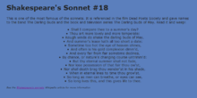

:page-layout: standard
:page-title: Year 9 IST - Activity One
:icons: font

= Year 9 IST - Activity One =

== Task: Shakespeare's Sonnet ==

This first activity only involves changing fonts and colours.

You should create a new workspace called *Activity 1* and make an HTML file called `index.html` inside the workspace. You will also need to create a CSS file called `main.css` in which you need to write all your CSS code for this activity.

At the end of the activity your page needs to look like the following (click for a larger version):

Here's the HTML to get you started:

....
<html>
	<head>
		<title>CSS Challenge 1</title>
	</head>
	<body>
		<h1>Shakespeare's Sonnet #18</h1>
		
This is one of the most famous of the sonnets. It is referenced
		in the film Dead Poets Society and gave names to the band The
		Darling Buds and the book and television series The Darling Buds
		of May. Read it and weep!

		<ul>
			<li>Shall I compare thee to a summer's day?</li>
			<li>Thou art more lovely and more temperate:</li>
			<li>Rough winds do shake the darling buds of May,</li>
			<li>And summer's lease hath all too short a date:</li>
			<li>Sometime too hot the eye of heaven shines,</li>
			<li>And often is his gold complexion dimm'd,</li>
			<li>And every fair from fair sometime declines,</li>
			<li>By chance, or nature's changing course untrimm'd:</li>
			<li>But thy eternal summer shall not fade,</li>
			<li>Nor lose possession of that fair thou ow'st,</li>
			<li>Nor shall death brag thou wander'st in his shade,</li>
			<li>When in eternal lines to time thou grow'st,</li>
			<li>So long as men can breathe, or eyes can see,</li>
			<li>So long lives this, and this gives life to thee.</li>
		</ul>
		
See the
		<a href="http://en.wikipedia.org/wiki/Shakespeare%27s_Sonnets">
		Shakespeare's sonnets</a> Wikipedia article for more information

	</body>
</html>
....

Hints:

* The font used is Verdana.
* You'll need to figure out the background colour yourself (hint, download the image and open in Photoshop, or another image editor, and use the colour picker to get the hexadecimal colour value.
* Don't worry if your text doesn't wrap at the same word -- it will depend on the size of your browser window.
* Make sure that your page validates as XHTML 1.0 Strict at http://validator.w3.org[http://validator.w3.org^].
* Make sure that your CSS validates at http://jigsaw.w3.org/css-validator[http://jigsaw.w3.org/css-validator^].

'''

[footnote]##Credit: Wikiversity, Web Design/CSS Challenges 1: http://en.wikiversity.org/wiki/Web_Design/CSS_challenges[http://en.wikiversity.org/wiki/Web_Design/CSS_challenges^]##
