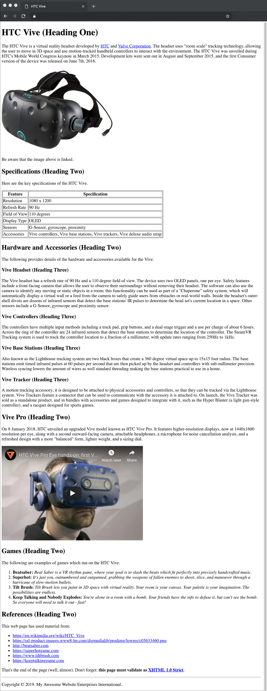

:page-layout: standard_toc
:page-title: Year 8 IST - Assignment One
:icons: font

= Year 8 IST - Assignment One =

*Weight:* 25% +
*Due:* Tuesday 25 March 2019 (Week 8) by 8:45am

== Changelog ==

This assignment was last updated on *Saturday 16 February 2019*.

If any changes are made to the assignment they will be itemised here for ease of identification.

Also, sometimes errors and bugs make it into the assignments. If you find a problem then please let Mr Purcell know!

== Task Context ==

This assignment requires you to code a single webpage which complies (and validates) with the XHTML 1.0 Strict standard.

=== CSS coding ===

This task does not require any CSS coding - it is purely an HTML coding exercise.

=== Marking guidelines ===

Make sure that you consult the <<_marking_guidelines, marking guidelines>> at the end of this document to ensure that your submission meets all the requirements. This specifically specifies what you need to do in order to gain every mark for this task.

=== How to start ===

Make sure you fully read this document first, and then go the <<_getting_started, Getting Started>> section.

=== Outcomes/Assessment Criteria ===

* *ACTDIK023:* Investigate how data is transmitted and secured in wired, wireless and mobile networks, and how the specifications affect performance.
* *ACTDIK024:* Investigate how digital systems represent text, image and audio data in binary.
* *ACTDIP025:* Acquire data from a range of sources and evaluate authenticity, accuracy and timeliness.
* *ACTDIP028:* Design the user experience of a digital system, generating, evaluating and communicating alternative designs.

== Task Requirements ==

Read this section carefully, it describes what you need to do for this task.

=== Sample Page Screenshot ===

You need to create a web page which *EXACTLY* replicates the content and layout of the page shown below (this is a screenshot, so you cannot copy and paste anything from this example).

Be aware, the text wrapping of the page will change depending on the width of the browser window (e.g. if you have a wider browser window then the text will wrap onto the next line at a different point). This is fine and is unavoidable.

The page below has been displayed/rendered in https://www.google.com/chrome[Google Chrome^] version 71 (the latest version available at the time of writing). Your assignment will be only tested in Chrome, so you should do all your development and testing in Chrome. If you are developing on a Windows-based PC then the font rendering may be slightly different (i.e. less smooth) — that is fine.

Additionally, your webpage must *FULLY* validate (i.e. with no warnings or errors) as XHTML 1.0 Strict using the W3C validator located at http://validator.w3.org[http://validator.w3.org^].

_Tip, click the image to see a larger version._

=== Page Text ===

To avoid you having to retype all the text in the page you can find a copy of the web page text below, so that it can be copied and pasted into your own page.

Note: There are some references in the page (e.g. [1], [2], etc.) which tell you the destination of links, source of images, etc. *Make sure you DO NOT include those in your web page*, as they are just to provide you with information that is not obvious from the screen shot above.

....

HTC Vive (Heading One)

The HTC Vive is a virtual reality headset developed by HTC[1] and Valve Corporation[2]. The headset uses "room scale" tracking technology, allowing the user to move in 3D space and use motion-tracked handheld controllers to interact with the environment. The HTC Vive was unveiled during HTC's Mobile World Congress keynote in March 2015. Development kits were sent out in August and September 2015, and the first Consumer version of the device was released on June 7th, 2016.

HTC VIVE HEADSET IMAGE [1][2]

Be aware that the image above is linked.

Specifications (Heading Two)

Here are the key specifications of the HTC Vive.

Feature	Specification
Resolution		1080 x 1200
Refresh Rate 	90 Hz
Field of View	110 degrees
Display Type	OLED
Sensors			G-Sensor, gyroscope, proximity
Accessories		Vive controllers, Vive base stations, Vive trackers, Vive deluxe audio strap

Hardware and Accessories (Heading Two)

The following provides details of the hardware and accessories available for the Vive.

Vive Headset (Heading Three)

The Vive headset has a refresh rate of 90 Hz and a 110 degree field of view. The device uses two OLED panels, one per eye. Safety features include a front-facing camera that allows the user to observe their surroundings without removing their headset. The software can also use the camera to identify any moving or static objects in a room; this functionality can be used as part of a "Chaperone" safety system, which will automatically display a virtual wall or a feed from the camera to safely guide users from obstacles or real-world walls. Inside the headset's outer-shell divots are dozens of infrared sensors that detect the base stations' IR pulses to determine the head set's current location in a space. Other sensors include a G-Sensor, gyroscope and proximity sensor.

Vive Controllers (Heading Three)

The controllers have multiple input methods including a track pad, grip buttons, and a dual-stage trigger and a use per charge of about 6 hours. Across the ring of the controller are 24 infrared sensors that detect the base stations to determine the location of the controller. The SteamVR Tracking system is used to track the controller location to a fraction of a millimeter, with update rates ranging from 250Hz to 1kHz.

Vive Base Stations (Heading Three)

Also known as the Lighthouse tracking system are two black boxes that create a 360 degree virtual space up to 15x15 foot radius. The base stations emit timed infrared pulses at 60 pulses per second that are then picked up by the headset and controllers with sub-millimeter precision. Wireless syncing lowers the amount of wires as well standard threading making the base stations practical to use in a home.

Vive Tracker (Heading Three)

A motion tracking accessory; it is designed to be attached to physical accessories and controllers, so that they can be tracked via the Lighthouse system. Vive Trackers feature a connector that can be used to communicate with the accessory it is attached to. On launch, the Vive Tracker was sold as a standalone product, and in bundles with accessories and games designed to integrate with it, such as the Hyper Blaster (a light gun-style controller), and a racquet designed for sports games.

Vive Pro (Heading Two)

On 8 January 2018, HTC unveiled an upgraded Vive model known as HTC Vive Pro. It features higher-resolution displays, now at 1440x1600 resolution per eye, along with a second outward-facing camera, attachable headphones, a microphone for noise cancellation analysis, and a refreshed design with a more "balanced" form, lighter weight, and a sizing dial.

HTC VIVE PRO VIDEO [5]

Games (Heading Two)

The following are examples of games which run on the HTC Vive.

Beatsaber: Beat Saber is a VR rhythm game, where your goal is to slash the beats which fit perfectly into precisely handcrafted music.

Superhot: It's just you, outnumbered and outgunned, grabbing the weapons of fallen enemies to shoot, slice, and maneuver through a hurricane of slow-motion bullets.

Tilt Brush: Tilt Brush lets you paint in 3D space with virtual reality. Your room is your canvas. Your palette is your imagination. The possibilities are endless.

Keep Talking and Nobody Explodes: You're alone in a room with a bomb. Your friends have the info to defuse it, but can't see the bomb. So everyone will need to talk it out - fast!

References (Heading Two)

This web page has used material from:

https://en.wikipedia.org/wiki/HTC_Vive
https://ssl-product-images.www8-hp.com/digmedialib/prodimg/lowres/c05633460.png
http://beatsaber.com
https://superhotgame.com
https://www.tiltbrush.com
https://keeptalkinggame.com

That's the end of the page (well, almost). Don't forget: this page must validate as XHTML 1.0 Strict [6].

Copyright © 2019. My Awesome Website Enterprises International.

[1] Text link: http://www.htc.com
[2] Text link: http://www.valvesoftware.com
[3] Image source: https://raw.githubusercontent.com/CanberraGrammar/year9-website/master/2019/s1assign1/vive.jpg
[4] Image link: https://www.vive.com/au
[5] Video source: https://www.youtube.com/watch?v=lxsLOnY9Yg4
[6] Text link: http://validator.w3.org
....

[#_getting_started]
=== Getting Started ===

Fork the *Assignment 1 (Semester 1)* workspace in ED STEM which will provide you with a valid XHTML 1.0 Strict template to commence work. *DO NOT* rename this workspace, otherwise we might not be able to find your work later for marking.

== Hints and Pro Tips ==

Here you can find various hints and tips to complete the assignment tasks.

* You must have attention to detail and ensure that your page EXACTLY replicates the sample page, including individual spaces between words in the text portions of the page and also comments which have been included to help you (e.g. _Be aware that the image above is linked_). Any differences will result in lost marks. *You are strongly encouraged to have someone else (e.g. parents) look over your page for any differences.*
* Your webpage must FULLY validate (i.e. with no warnings or errors) as XHTML 1.0 Strict using the W3C validator located at http://validator.w3.org[http://validator.w3.org^].
* Make sure that you look at the sample page carefully and note any text in *bold*, _italics_, or other special formatting as that all needs to be replicated in your version of the page.
* The title of the webpage is "HTC Vive"
* The HTC Vive image is available from https://raw.githubusercontent.com/CanberraGrammar/year9-website/master/2019/s1assign1/vive.jpg[https://raw.githubusercontent.com/CanberraGrammar/year9-website/master/2019/s1assign1/vive.jpg^]. Do not locally download the vive.jpg file to your ED STEM workspace - source the image from github.com using this address.
* The HTC Vive image is linked to: https://www.vive.com/au[https://www.vive.com/au^].
* There are some links in the page and the destination of these links is not obvious from the screenshot. As such, the link destinations are included in the web page text extract included above. Don't forget to include them!
* The dimensions / size of the embedded YouTube video is `width="510"` and `height="340"`.

== Submission Instructions ==

This assignment is worth 25% of your Semester One assessment for this subject.

To submit your assignment you do not need to do anything, we will view your submission in your ED STEM workspace. However, you *must not* change your workspace after the due date and time. We can see the revision history on your workspace and will be actively checking the last time you modified the workspace.

*Late submissions will incur penalties as per the school assessment policy:* For assignments and non-test events a late work penalty of 10% of the total possible mark will be incurred for each day late if work is not submitted on the due date.  A loss of 30% is incurred if work due on a Friday is not submitted until the following Monday. After one week (7 days) the item will be awarded a mark of zero.

=== Draft submissions ===

You may optionally (but strongly encouraged) submit one draft of your assignment for review prior to formal submission. Your draft must be feature complete (i.e. not a half-done assignment) and submitted at least one week before the assignment due date - for this assignment, drafts are due by 8:45am on Tuesday 18 March 2019). To submit a draft email your teacher and let them know your workspace is ready to be reviewed.

[#_marking_guidelines]
=== Marking Guidelines ===

link:marking-guidelines.pdf[Your assignment will be marked following the criteria in this PDF file.^]

*You must NOT use any CSS code in this assignment.* This includes usage of in-line styles (e.g. `
`). There should be no need to use CSS anyway, as there is no special styling required in this task.

=== All My Own Work

Please note that any submitted work is to be your own. There are serious consequences for submitting work which is taken from another person, even if they give it to you voluntarily. To decide if you have written the material, we may need to question you about your understanding of the topic. Please be careful when presenting ideas which are not entirely your own; reference such material thoroughly.

For more specific examples, see the <<course_overview/course_overview.adoc#academic-honesty, Academic Honesty>> section of the Course Outline.
