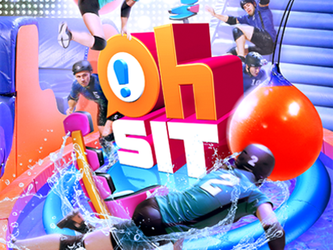

:page-layout: standard_toc
:page-title: Year 8 IST - Assignment One
:icons: font

= Year 8 IST - Assignment One (Semester Two)

*Weight:* 40% +
*Due:* Thursday 12 September 2019 (Week 8) by 8:45am

== Changelog

This assignment was last updated on *Saturday 3 August 2019*.

If any changes are made to the assignment they will be itemised here for ease of identification.

== Task Context

In this assignment you are going to create a game of Rock Paper Scissors, where you need to try and beat the computer at this well-known game.

=== Marking guidelines

Make sure that you consult the <<_marking_guidelines, marking guidelines>> at the end of this document to ensure that your submission meets all the requirements.

=== Reporting Criteria

* Demonstrating an understanding of core programming concepts, particularly variables, data types, and control structures
* Implementing interactivity on web pages and correctly handling events
* Understanding appropriate use and implementation of functions
* Writing neat and well-formatted code, with whitespace and indentation as appropriate
* Including sufficient comments to explain the logic and purpose of the code

== Task Description

You have been employed by a major US cable television network to produce the online game for a brand new blockbuster TV show which will premiering this summer — *Extreme Rock Paper Scissors!* This show is from the same producers who brought you hit shows such as Oh Sit! so you know that it will most definitely be a phenomenally popular production.

Unfortunately, the software engineer in charge of the project decided to cash-out his portion of the $20 million budget for this project and fled to https://en.wikipedia.org/wiki/Extradition_law_in_Australia[Russia, window="_blank"], leaving you to finish the project. The boss needs the game complete before the show premieres on 12 September, so it's up to you! No pressure...

Before the engineer boarded his flight to Moscow he uploaded the partially complete game to ED STEM called *Assignment 1 (Semester 2) - Rock Paper Scissors* which you can fork. This contains the HTML and CSS which you need for the game - so you do not need to do any front-end development. Your job is writing the JavaScript code to make the game function.

=== Your Task

There are four tasks you need to complete to get this program into a fully working state.

* *Implement the `basicComputerPlayer()` function (5 marks).* This function is the computer-based player, but it's not really that smart — it just picks rock, paper, or scissors at random. You need to implement the function such that it generates a random number from 0, 1, or 2 (corresponding to rock, paper, or scissors), displays the graphic for what the computer's chose (by calling the provided `displayComputerPlayerSymbol` function with the relevant parameter (you will need to read and understand that method to find out what's required), and then returns the random number.

* *Finish the `checkWinner(humanChoice, computerChoice)` function (10 marks).* As you can see, this function takes two parameters — `humanChoice` and `computerChoice` corresponding to the gesture (0, 1, or 2 being rock, paper, or scissors) which the human and computer selected for a round of the game. It then returns either `"Human"`, `"Computer"`, or `"Tie"` depending on the outcome of who won. You need to finish this function so it can determine who has won, given the gesture which the human selected and computer selected (e.g. if the human selected `0` for rock, and the computer selected `1` for paper, then the result would be `"Computer"` as the computer won — since paper beats rock).

*Once you finish these first two parts the game should be in a playable and working state*

* *Finish the `updateScores(winner)` function (8 marks).* There are HTML elements to display the score, and global variables in the JavaScript to keep track of the score, but it does not work yet. Write the necessary code in the `updateScores` function to update the scores, depending on the outcome of each round, and then also update the user interface with the new scores.

* *Implement the `advancedComputerPlayer()` function (12 marks).* A game theory strategy to maximise your changes of winning at this game is called win-stay, lose-switch. This means if on the previous round you won, then you should play the same strategy in the next round (e.g. if you won with rock on the last round then you should play rock again on the next round). However, if you lost then you should switch to a different strategy on the next round (e.g. if you lost with rock on the last round then you should switch to either paper or scissors on the next round).
+
Implement a computer player algorithm in `advancedComputerPlayer()` which adopts a win-stay, lose-switch strategy towards playing the game.
+
In the event that it does a lose-switch, you can just randomly select one of the two available options (e.g. if rock lost on the previous round, play either paper or scissors on the next round — just randomly choose one or the other, there's no rule about which one should be selected).
+
If you attempt this you can comment out the `basicComputerPlayer` call in the `humanPlayer` function and instead uncomment/call the `advancedComputerPlayer` function.
+
Note, for this question you are permitted to add global variables in the denoted section at the top of the JavaScript if needed.

== Submission Instructions

This assignment is worth 40% of your Semester Two assessment for this subject.

To submit your assignment you do not need to do anything, we will view your submission in your ED STEM workspace. However, you *must not* change your workspace after the due date and time. We can see the revision history on your workspace and will be actively checking the last time you modified the workspace.

*Late submissions will incur penalties as per the school assessment policy:* For assignments and non-test events a late work penalty of 10% of the total possible mark will be incurred for each day late if work is not submitted on the due date. A loss of 30% is incurred if work due on a Friday is not submitted until the following Monday. After one week (7 days) the item will be awarded a mark of zero.

=== Draft submissions

You may optionally (but strongly encouraged) submit one draft of your assignment for review prior to formal submission. Your draft must be feature complete (i.e. not a half-done assignment) and submitted at least one week before the assignment due date - for this assignment, drafts are due by 8:45am on Thursday 5 September 2019). To submit a draft email your teacher and let them know your workspace is ready to be reviewed.

[#_marking_guidelines]
=== Marking Guidelines

link:marking-guidelines.pdf[Your assignment will be marked following the criteria in this PDF file.^]

[#_academic_honesty]
== Academic Honesty

include::../common/academic_honesty.adoc[]

