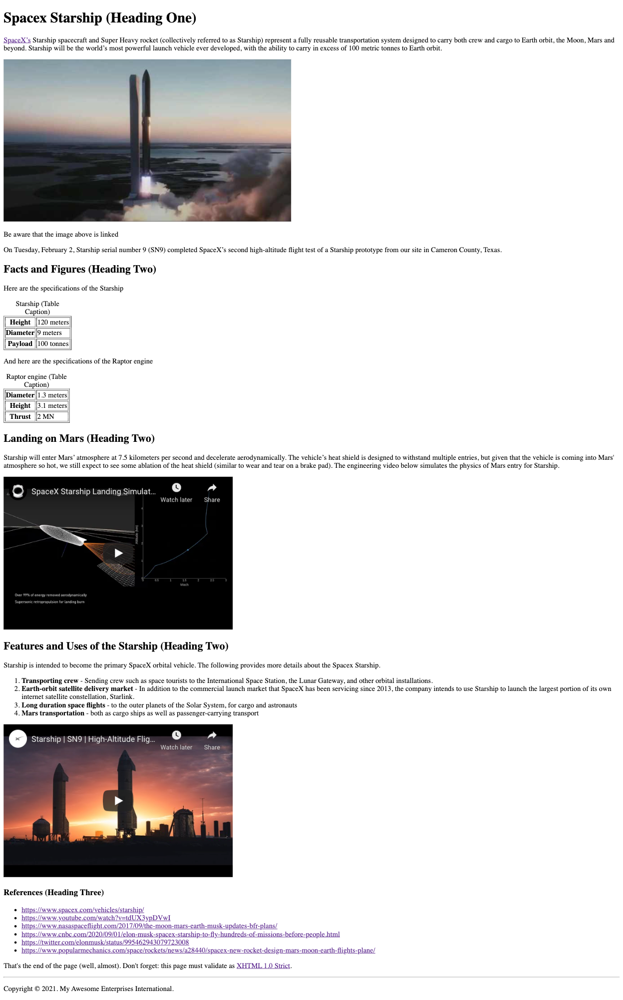

:page-layout: standard_toc
:page-title: Year 8 IST - Assignment One
:icons: font

= Year 8 IST - Assignment One =

*Weight:* 30% +
*Due:* Thursday 11 March 2021 (Week 6) by 8:45am

== Changelog ==

This assignment was last updated on *Monday 15 February 2021*.

* *UPDATED 22 FEBRUARY 2021* Fixed a typo in the second video's alternate text in the page-text file (Spacex Starship High-Altitude Flight Test Video [5])

Removed an unnecessary "&t" from the end of the second video's link which caused errors when validating the code.

* *UPDATED 17 FEBRUARY 2021*: Made corrections to the page-text file to correctly replicate the screenshot. Please re-fork the assignment template if you haven't already.

If any changes are made to the assignment they will be itemised here for ease of identification.

Also, sometimes errors and bugs make it into the assignments. If you find a problem then please let your teacher know!

== Task Context ==

This assignment requires you to code a single webpage which complies (and validates) with the XHTML 1.0 Strict standard.

=== CSS coding ===

This task does not require any CSS coding - it is purely an HTML coding exercise.

=== Marking guidelines ===

Make sure that you consult the <<_marking_guidelines, marking guidelines>> at the end of this document to ensure that your submission meets all the requirements. This specifically specifies what you need to do in order to gain every mark for this task.

=== How to start ===

Make sure you fully read this document first, and then go the <<_getting_started, Getting Started>> section.

=== Outcomes/Assessment Criteria ===

* *ACTDIK023:* Investigate how data is transmitted and secured in wired, wireless and mobile networks, and how the specifications affect performance.
* *ACTDIK024:* Investigate how digital systems represent text, image and audio data in binary.
* *ACTDIP025:* Acquire data from a range of sources and evaluate authenticity, accuracy and timeliness.
* *ACTDIP028:* Design the user experience of a digital system, generating, evaluating and communicating alternative designs.

== Task Requirements ==

Read this section carefully, it describes what you need to do for this task.

=== Sample Page Screenshot ===

You need to create a web page which *EXACTLY* replicates the content and layout of the page shown below (this is a screenshot, so you cannot copy and paste anything from this example).

Be aware, the text wrapping of the page will change depending on the width of the browser window (e.g. if you have a wider browser window then the text will wrap onto the next line at a different point). This is fine and is unavoidable.

The page below has been displayed/rendered in https://www.google.com/chrome[Google Chrome^] version 71 (the latest version available at the time of writing). Your assignment will be only tested in Chrome, so you should do all your development and testing in Chrome. If you are developing on a Windows-based PC then the font rendering may be slightly different (i.e. less smooth) — that is fine.

Additionally, your webpage must *FULLY* validate (i.e. with no warnings or errors) as XHTML 1.0 Strict using the W3C validator located at http://validator.w3.org[http://validator.w3.org^].

_Tip, click the image to see a larger version._

[#_getting_started]
=== Getting Started ===

Fork the *Assignment 1 (Semester 1)* workspace in ED STEM which will provide you with a valid XHTML 1.0 Strict template to commence work. *DO NOT* rename this workspace, otherwise we might not be able to find your work later for marking.

=== Page Text ===

To avoid you having to retype all the text in the page you can find a copy of the web page text within your ED STEM workspace.

Note: There are some references in the page (e.g. [1], [2], etc.) which tell you the destination of links, source of images, etc. *Make sure you DO NOT include those in your web page*, as they are just to provide you with information that is not obvious from the screen shot above.

== Hints and Pro Tips ==

Here you can find various hints and tips to complete the assignment tasks.

* You must have attention to detail and ensure that your page EXACTLY replicates the sample page, including individual spaces between words in the text portions of the page and also comments which have been included to help you (e.g. _Be aware that the image above is linked_). Any differences will result in lost marks. *You are strongly encouraged to have someone else (e.g. parents) look over your page for any differences.*
* Your webpage must FULLY validate (i.e. with no warnings or errors) as XHTML 1.0 Strict using the W3C validator located at http://validator.w3.org[http://validator.w3.org^].
* Make sure that you look at the sample page carefully and note any text in *bold*, _italics_, or other special formatting as that all needs to be replicated in your version of the page.
* The title of the webpage is "Spacex Starship"
* The Spacex Starship image is available from https://raw.githubusercontent.com/CanberraGrammar/year8-website/master/2021/s1assign1/starship_bn1.jpg[https://raw.githubusercontent.com/CanberraGrammar/year8-website/master/2021/s1assign1/starship_bn1.jpg^]. Do not locally download the starship_bn1.jpg file to your ED STEM workspace - source the image from github.com using this address.
* There are some links in the page and the destination of these links is not obvious from the screenshot. As such, the link destinations are included in the web page text extract included above. Don't forget to include them!
* The dimensions / size of the embedded YouTube video is `width="510"` and `height="340"`.

== Submission Instructions ==

This assignment is worth 30% of your Semester One assessment for this subject.

To submit your assignment you do not need to do anything, we will view your submission in your ED STEM workspace. However, you *must not* change your workspace after the due date and time. We can see the revision history on your workspace and will be actively checking the last time you modified the workspace.

*Late submissions will incur penalties as per the school assessment policy*

=== Draft submissions ===

You may optionally (but strongly encouraged) submit one draft of your assignment for review prior to formal submission. Your draft must be feature complete (i.e. not a half-done assignment) and submitted at least one week before the assignment due date - for this assignment, drafts are due by 8:45am on Thursday 4 March 2021). To submit a draft email your teacher and let them know your workspace is ready to be reviewed.

[#_marking_guidelines]
=== Marking Guidelines ===

link:marking-guidelines.pdf[Your assignment will be marked following the criteria in this PDF file.^]

*You must NOT use any CSS code in this assignment.* This includes usage of in-line styles (e.g. `
`). There should be no need to use CSS anyway, as there is no special styling required in this task.

=== All My Own Work

Please note that any submitted work is to be your own. There are serious consequences for submitting work which is taken from another person, even if they give it to you voluntarily. To decide if you have written the material, we may need to question you about your understanding of the topic. Please be careful when presenting ideas which are not entirely your own; reference such material thoroughly.

For more specific examples, see the <<common/academic_honesty.adoc#, Academic Honesty>> section of the Course Outline.
